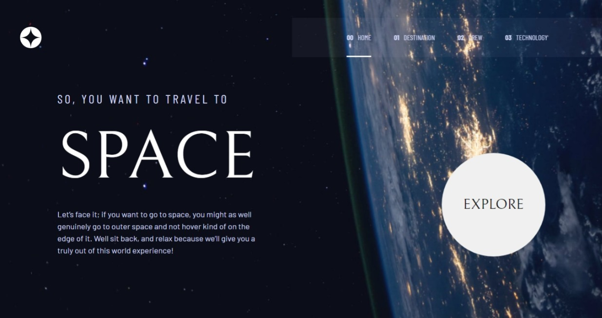
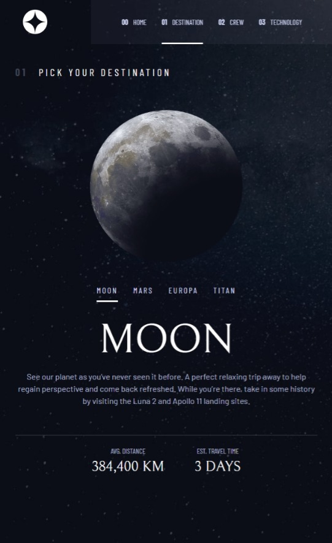
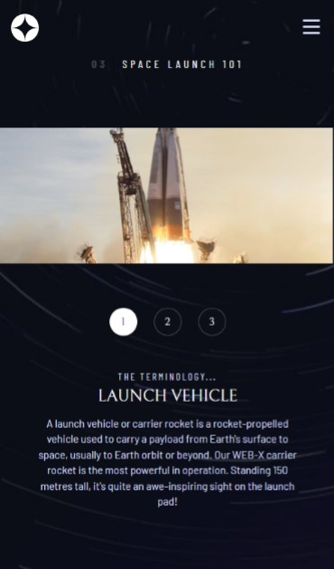

# Frontend Mentor - Space tourism website solution

This is a solution to the [Space tourism website challenge on Frontend Mentor](https://www.frontendmentor.io/challenges/space-tourism-multipage-website-gRWj1URZ3). Frontend Mentor challenges help you improve your coding skills by building realistic projects.

## Table of contents

-  [Overview](#overview)
   -  [The challenge](#the-challenge)
   -  [Screenshot](#screenshot)
   -  [Links](#links)
-  [My process](#my-process)
   -  [Built with](#built-with)
-  [Author](#author)

## Overview

### The challenge

Users should be able to:

-  View the optimal layout for each of the website's pages depending on their device's screen size
-  See hover states for all interactive elements on the page
-  View each page and be able to toggle between the tabs to see new information

### Screenshot

### Links

-  Solution URL: [https://github.com/johnsiner/space-tourism-website](https://github.com/johnsiner/space-tourism-website)
-  Live Site URL: [https://space-tourism-webpage.herokuapp.com/](https://space-tourism-webpage.herokuapp.com/)

### Built with

-  Semantic HTML5 markup
-  CSS custom properties
-  Flexbox
-  [React](https://reactjs.org/) - JS library
-  [React Router dom](https://reactrouter.com/) - For page routing
-  [React Helmet Async](https://www.npmjs.com/package/react-helmet-async) For page titling

## Author

-  Frontend Mentor - [@johnsiner](https://www.frontendmentor.io/profile/johnsiner)
-  Twitter - [@iam_johnsin](https://www.twitter.com/iam_johnsin)
